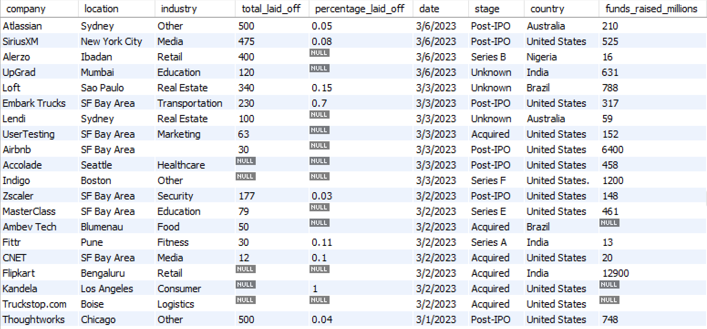

# Data Cleaning using MySQL

## In this project I took "layoffs.csv", which included over 2000 entries, imported it into MySQL and cleaned the data.

Steps
1. check for and remove any duplicates
2. standardize data and fix errors
3. Look at null values
4. remove columns and rows that are not necessary
